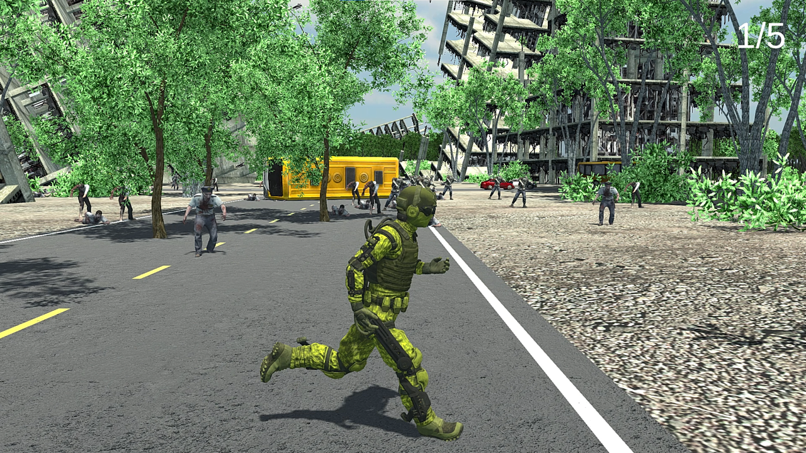

## The project 🚀
It is a little project I made during a beautiful day of creativity and determination of my 2021 summer vacation. Its synopsis is based on the ridiculous toilet paper chaos during lockdowns around the world, causing riots and shortages.

“In an apocalyptic world infested by zombies, toilet tissue has become a rare resource. Luckily, a group of rolls has been detected in a restricted area. As an elite soldier you are sent in mission to find the precious paper”.

There are 5 rolls spread across the map. Zombies are headed you from everywhere. Good luck soldier.

## What I learned 🌟
- Make a game in a few hours with Unity

## Gallery 🖼️
|||
:-------------------------:|:-------------------------:
|I have heard zombies can't climb, is it true ?|No time to stop and take a selfie, you must run !|

|||
:-------------------------:|:-------------------------:
|Roger, I have a target in sight|The nation is proud of you soldier|

## Demo video 🎥
Here is a link to the presentation video we made to promote the game to our friends  

PS : In French, “PQ” is slang for toilet paper, but unfortunately the pun is lost in English
